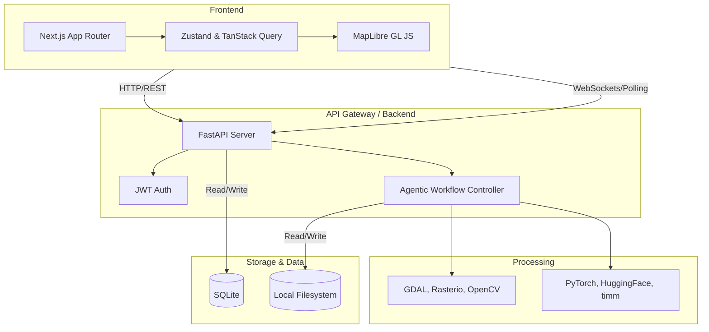
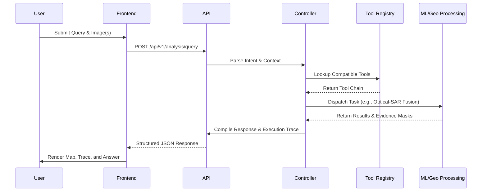

# System Architecture

## Overview
The architecture is designed to handle multimodal remote sensing data efficiently, offering a modern web interface backed by a local, synchronous geospatial backend.

## Agentic Controller Workflow
The Agentic Controller routes natural language queries to the appropriate processing pipelines.

